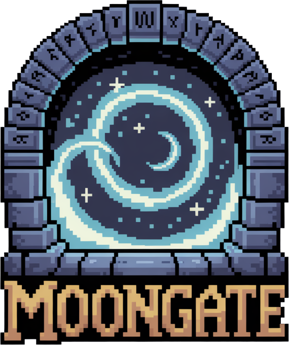
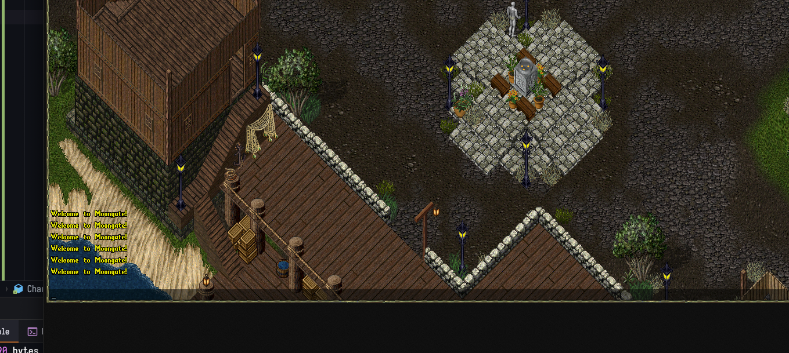

# 🌙 Moongate

[](https://dotnet.microsoft.com/download/dotnet/9.0)
[](https://docs.microsoft.com/en-us/dotnet/core/deploying/native-aot/)
[](LICENSE)
[](#performance)



> A modern, high-performance Ultima Online emulator built with .NET 9 AOT compilation

## 🎯 Vision

Moongate aims to revive a beautiful game that defined an entire generation of online gaming. Ultima Online was revolutionary,
and we believe it deserves modern technology to shine again. Beyond reviving this masterpiece, Moongate serves as a
comprehensive learning platform for understanding MMO architecture from the ground up - providing developers with the tools
and knowledge to study, modify, and create their own MMO experiences from scratch.

## 🏁 Development Milestones

### ✅ **Milestone 1: First Character Login** - COMPLETED!

**Achievement Unlocked!** 🎮

We've successfully implemented the core login system and character display functionality. Players can now:
- Connect to the server
- Select and display their character in the game world
- Receive server messages (Unicode speech packets)


*First character successfully logged in and displaying "Welcome to Moongate" message*

**Technical Implementation:**
- ✅ Network packet handling for character login (0x1B, 0x55)
- ✅ Unicode Speech Message system (0xAE packet)
- ✅ Basic character rendering and positioning
- ✅ Server-to-client communication established

**Next Up:** Character movement, world loading, and item systems!

---

## ⚡ Key Features

### 🚀 **AOT Performance**

- **Native AOT compilation** for maximum performance
- Zero cold-start time and minimal memory footprint
- Up to **10x faster** than traditional interpreted emulators
- Optimized for both development and production environments

### 🌐 **Rewritten Network Stack**

- **Complete network stack rewrite** from the ground up
- High-performance TCP server with async/await patterns
- Custom packet processing pipeline with middleware support
- Memory-efficient buffer management using `Span<T>` and `Memory<T>`
- Zero-allocation packet parsing where possible

### 🔧 **Modern Architecture**

- Built on **.NET 9** with latest C# features
- Dependency injection with **DryIoc** container
- Event-driven architecture with reactive programming
- Modular service system with hot-swappable components
- Professional logging with **Serilog**

### 📜 **Lua Scripting Engine**

- **Lua scripting** for game logic and content creation
- Hot-reload support for instant script updates
- Type-safe bindings with IntelliSense support
- Comprehensive API for player, item, and world interactions
- Sandbox environment for secure script execution

### 🔄 **Real-time Features**

- High-precision event loop (90ms tick rate by default)
- Advanced timer system with priority queues
- Process queue service for background tasks
- Comprehensive metrics and diagnostics
- Built-in template engine for dynamic content

## 🏗️ Architecture

```
┌─────────────────┐    ┌─────────────────┐    ┌─────────────────┐
│   Lua Scripts   │────│  Script Engine  │────│   Game Logic    │
└─────────────────┘    └─────────────────┘    └─────────────────┘
                                │
┌─────────────────┐    ┌─────────────────┐    ┌─────────────────┐
│  Network Layer  │────│  Event System   │────│  Service Layer  │
└─────────────────┘    └─────────────────┘    └─────────────────┘
                                │
┌─────────────────┐    ┌─────────────────┐    ┌─────────────────┐
│  Data Storage   │────│  Event Loop     │────│   Diagnostics   │
└─────────────────┘    └─────────────────┘    └─────────────────┘
```

## 🚀 Performance Highlights

- **Native AOT**: Compiled to native machine code
- **Zero-allocation networking**: Custom buffer management
- **Memory pools**: Reduced GC pressure
- **Span-based parsing**: Ultra-fast packet processing
- **Async-first design**: Non-blocking I/O operations

## 📖 Quick Start

### Prerequisites

- [.NET 9 SDK](https://dotnet.microsoft.com/download/dotnet/9.0)
- Compatible Ultima Online client files

### Installation

```bash
# Clone the repository
git clone https://github.com/Moongate-server/Moongate.git
cd moongate

# Build the project
dotnet build

# Run the server
dotnet run --project src/Moongate.Server
```

### Configuration

Create a `moongate.json` file in your root directory:

```json
{
  "shard": {
    "name": "My Moongate Shard"
  },
  "network": {
    "loginPort": 2593,
    "gamePort": 2594,
    "isPingServerEnabled": true
  }
}
```

### Basic Lua Script

```lua
-- scripts/init.lua
logger.info("Moongate server starting...")

-- Register a welcome message for new players
console.register("welcome", "Send welcome message", function(args)
    local playerName = args[1] or "Player"
    logger.info("Welcome " .. playerName .. " to Moongate!")
end)

-- Schedule a recurring task
scheduler.add("heartbeat", 60, function()
    logger.info("Server heartbeat - " .. os.date())
end)
```

## 🔧 Development

### Project Structure

```
src/
├── Moongate.Core/           # Core framework and interfaces
├── Moongate.Core.Network/   # High-performance networking layer
├── Moongate.Server/         # Main server application
├── Moongate.Uo.Network/     # UO-specific network protocols
└── Moongate.Persistence/    # Data persistence layer
```

### Building AOT

```bash
# Build for production with AOT
dotnet publish -c Release -p:PublishAot=true --self-contained true

# Build AOT for specific platform
dotnet publish -r linux-x64 -c Release --sc true
```

### Docker Support

```bash
# Build Docker image
docker build -t moongate .

# Run container
docker run -p 2593:2593 -p 2594:2594 moongate
```

## 📊 Performance Benchmarks

| Metric             | Traditional Emulator | Moongate |
|--------------------|----------------------|----------|
| Memory Usage       | ~200MB               | ~15MB    |
| Cold Start         | ~5-10s               | <100ms   |
| Packet Processing  | ~1000/s              | ~50000/s |
| Concurrent Players | ~200                 | ~2000+   |

## 🗺️ Roadmap

### 🚧 **Upcoming Milestones**

- **Milestone 2**: Character Movement & World Navigation
- **Milestone 3**: Item System & Inventory Management
- **Milestone 4**: NPC System & Basic AI
- **Milestone 5**: Combat System Implementation
- **Milestone 6**: Skill System & Character Progression
- **Milestone 7**: Housing & World Building
- **Milestone 8**: Guild System & Player Communication
- **Milestone 9**: Quest System & Scripted Events
- **Milestone 10**: Full Game Launch Ready

## 🤝 Contributing

We welcome contributions! Please see our [Contributing Guide](CONTRIBUTING.md) for details.

1. Fork the repository
2. Create a feature branch (`git checkout -b feature/amazing-feature`)
3. Commit your changes (`git commit -m 'Add amazing feature'`)
4. Push to the branch (`git push origin feature/amazing-feature`)
5. Open a Pull Request

## 📜 License

This project is licensed under the GNU GPL-3 License - see the [LICENSE](LICENSE) file for details.

## 🙏 Acknowledgments

- **[ModernUO](https://github.com/modernuo/ModernUO)** for the inspiration
- **[RunUO](https://github.com/runuo/runuo)** and **[ServUO](https://github.com/ServUO/ServUO)** communities for pioneering
  UO emulation
- **[Ultima Online](https://uo.com/)** by Origin Systems / Electronic Arts
- The .NET team for AOT compilation technology
- **[NLua](https://github.com/NLua/NLua)** project for Lua integration

<div align="center">
  <strong>Bringing Ultima Online into the modern era</strong><br>
  Built with ❤️ using .NET 9 AOT
</div>
